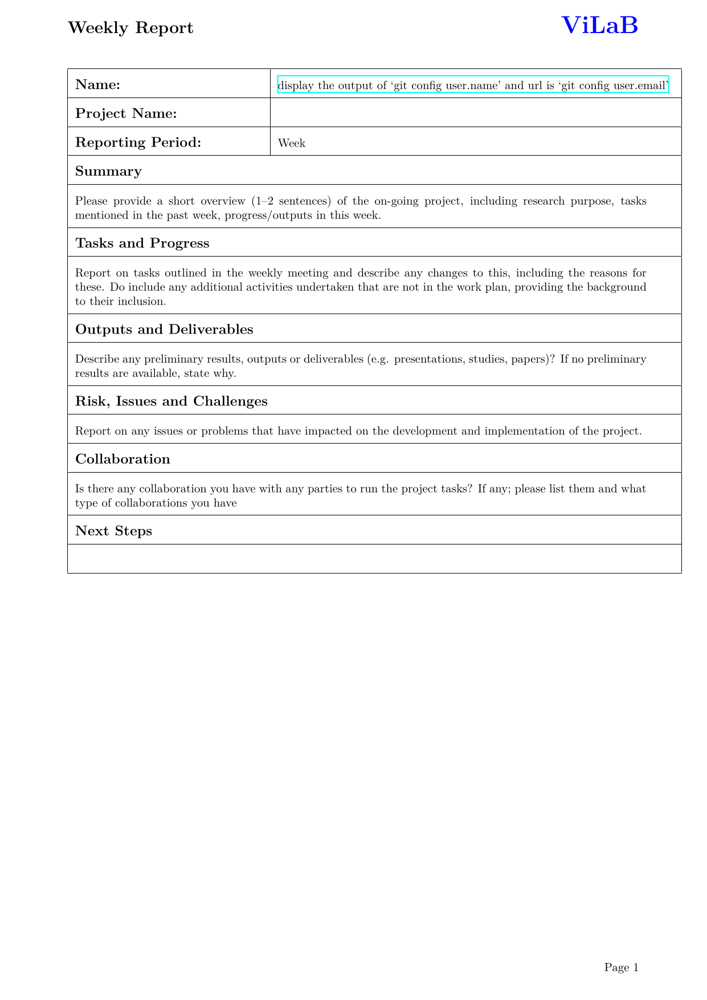

# Weekly Report Template

[](https://results.pre-commit.ci/latest/github/Freed-Wu/weekly-report-template/main)

[](https://github.com/Freed-Wu/weekly-report-template/releases)
[](https://github.com/Freed-Wu/weekly-report-template/releases/latest)
[](https://github.com/Freed-Wu/weekly-report-template/issues)
[](https://github.com/Freed-Wu/weekly-report-template/issues?q=is%3Aissue+is%3Aclosed)
[](https://github.com/Freed-Wu/weekly-report-template/pulls)
[](https://github.com/Freed-Wu/weekly-report-template/pulls?q=is%3Apr+is%3Aclosed)
[](https://github.com/Freed-Wu/weekly-report-template/discussions)
[](https://github.com/Freed-Wu/weekly-report-template/milestones)
[](https://github.com/Freed-Wu/weekly-report-template/network/members)
[](https://github.com/Freed-Wu/weekly-report-template/stargazers)
[](https://github.com/Freed-Wu/weekly-report-template/watchers)
[](https://github.com/Freed-Wu/weekly-report-template/graphs/contributors)
[](https://github.com/Freed-Wu/weekly-report-template/graphs/commit-activity)
[](https://github.com/Freed-Wu/weekly-report-template/commits)
[](https://github.com/Freed-Wu/weekly-report-template/releases/latest)

[](https://github.com/Freed-Wu/weekly-report-template/blob/main/LICENSE)


A weekly report template for ViLaB.



A blank template is [here](template.tex).
**Don't edit it directly!** It is generated by `make`.

Put [hyperref config](hyperref.cfg) to any path `kpsewhere` can find, such as
the root directory of your `main.tex` or `TEXCONFIG`.

```sh
$ kpsewhere hyperref.cfg
./hyperref.cfg
$ cd ..
$ kpsewhich --var-value TEXMFCONFIG
/home/wzy/.texlive/texmf-config
$ kpsewhere hyperref.cfg
/home/wzy/.texlive/texmf-config/tex/latex/hyperref/hyperref.cfg
```

## Build

```sh
latexmk
```
